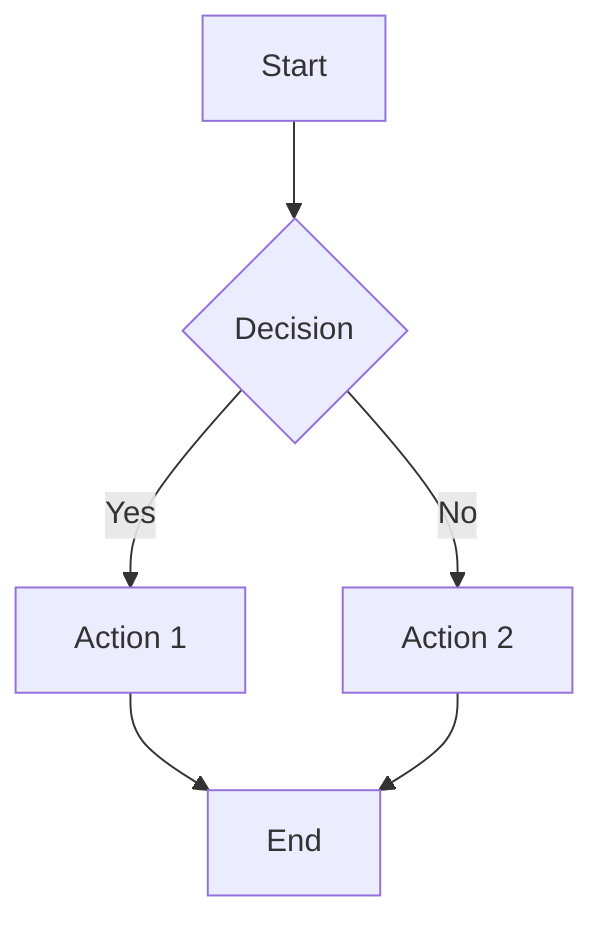
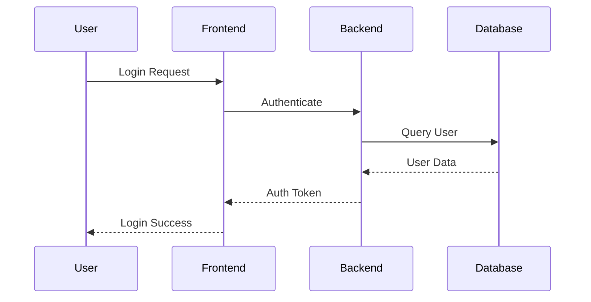
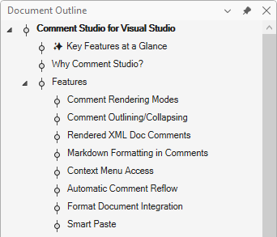
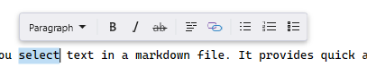

[marketplace]: <https://marketplace.visualstudio.com/items?itemName=MadsKristensen.MarkdownEditor2>
[vsixgallery]: <http://vsixgallery.com/extension/MarkdownEditor2022.2347dc70-1875-4775-bf48-f2b9fdfee8d4/>
[repo]:<https://github.com/madskristensen/MarkdownEditor2022>

# Markdown Editor v2 for Visual Studio

[](https://github.com/madskristensen/MarkdownEditor2022/actions/workflows/build.yaml)


Download this extension from the [Visual Studio Marketplace][marketplace]
or get the [CI build][vsixgallery].

----------

This extension delivers a full featured Markdown editor with live preview, syntax-aware editing, and turnkey workflows for GitHub flavored Markdown.

> **💡 Tip:** For the best experience, pair this extension with [Markdown Lint](https://marketplace.visualstudio.com/items?itemName=MadsKristensen.MarkdownLint) for linting/validation and [Image Optimizer](https://marketplace.visualstudio.com/items?itemName=MadsKristensen.ImageOptimizer64bit) for automatic image compression.

## Getting Started

1. Install the extension from the [Visual Studio Marketplace][marketplace] or grab the latest [CI build][vsixgallery].
2. Open any `.md` file in Visual Studio to enable the Markdown editor.
3. Press `F7` to show or hide the synchronized preview window while you edit.
4. Visit **Tools -> Options -> Text Editor -> Markdown** to tune fonts, preview behavior, and custom assets.

## Feature Highlights

### Editing essentials

- Powered by [Markdig](https://github.com/lunet-io/markdig), providing the best available Markdown parser.
- Syntax highlighting powered by Prism.js keeps fenced code blocks readable.
- Supports CommonMark, GitHub flavored Markdown, FrontMatter YAML, Mermaid, and math notation.
- Brace completion with type-through maintains list formatting and block structure.
- Lightning fast performance even in large documentation sets.

### Live preview

- Live preview window with scroll sync and dark theme support.
- Switch between vertical and horizontal layouts depending on the workspace.
- Automatically updates on each keystroke and tracks the editor caret.
- Honors custom CSS and HTML templates so the preview matches your documentation brand.

### Navigation and structure

- Jump between headings from the NavigationBar, Document Outline, or generated table of contents.
- Document Outline tool window shows a persistent hierarchical view of all headings.
- Collapse or expand fenced code and HTML blocks to stay focused.

### Media workflows

- Drag and drop images directly from Solution Explorer or File Explorer.
- Paste images from the clipboard, name them relative to the document, and get friendly alt text automatically.

### Productivity tools

- Extensive keyboard shortcuts speed up formatting, linking, commenting, and checklist maintenance.
- VS command URL links trigger Visual Studio commands straight from the preview pane.

The sections below dive deeper into each area and include screenshots for quick orientation.

### Live Preview Window

The preview window opens up on the right side of the document when it opens. Use `F7` to toggle the preview window on and off.


Every time the markdown document is modified, the preview window will update.

The preview window is automatically scrolled to match the scroll position of the document. As the document is scrolled up and down, the preview window will follow.

Live preview can be managed in the [settings](#settings).

#### Auto-hide tool window support

The preview window uses WebView2 which, due to its HWND-based rendering, can overlap Visual Studio's auto-hide tool windows (like Solution Explorer when pinned to auto-hide). To mitigate this, enable **Auto-hide for tool windows** in the settings.

When enabled, the preview temporarily hides when you expand an auto-hide tool window, and automatically reappears when the tool window collapses back. This ensures you can always interact with your tool windows without the preview getting in the way.

### Syntax highlighting

All fonts can be changed in **Tools -> Options -> Environment -> Fonts and Colors** dialog.


#### GitHub and other flavors

Advanced markdown extensions are supported to give more features to the syntax. This includes pipe tables, emoji, mathematics and a lot
more.

### Azure DevOps wiki syntax

The editor supports Azure DevOps wiki-specific syntax for generating a table of contents.

**Table of Contents (`[[_TOC_]]`):**

Add `[[_TOC_]]` anywhere in your document to automatically generate a table of contents based on all headings. The TOC renders as a nested list with links to each section.

```markdown
[[_TOC_]]

# Introduction
## Getting Started
## Installation
# Advanced Topics
```

This syntax is case-sensitive and must appear on its own line, matching Azure DevOps wiki behavior.

### Mermaid diagram support

The editor supports all Mermaid diagram types for visualizing complex information. Mermaid diagrams are rendered in the live preview window using the native Mermaid.js library.

**Supported diagram types include:**

- **Flowcharts** (`flowchart` or `graph TB/LR`) - For architectural diagrams, system designs, and process flows
- **Sequence Diagrams** (`sequenceDiagram`) - For operational flows like authentication, authorization, and API interactions
- **Class Diagrams** - For object-oriented designs
- **State Diagrams** - For state machine representations
- **Entity Relationship Diagrams** - For database schemas
- **Gantt Charts** - For project timelines
- **Pie Charts** - For data visualization
- And many more supported by Mermaid.js

**Example - Flowchart:**

````markdown

````

**Example - Sequence Diagram:**

````markdown

````

Mermaid diagrams automatically adapt to the current Visual Studio theme (light or dark mode).

#### Standalone Mermaid files

In addition to Mermaid code blocks in Markdown, the extension also supports standalone Mermaid files with `.mermaid` or `.mmd` extensions. These files get:

- Custom file icons in Solution Explorer
- Syntax highlighting including Mermaid comments (`%%`)
- Live preview rendering the diagram

This is useful when you want to maintain complex diagrams as separate files or share them across multiple documents.

### Root path configuration for Jekyll/GitHub Pages

When working with static site generators like Jekyll or GitHub Pages, you may want to use root-relative paths (paths starting with `/`) in your markdown files. The extension supports configuring a root path to properly resolve these paths in the preview.

#### Option 1: YAML front matter (per-file)

Add `root_path` to the YAML front matter of individual markdown files:

```yaml
---
root_path: C:\Projects\myblog
title: My Blog Post
---


[About Page](/about.md)
```

#### Option 2: .editorconfig (project-wide)

Add `md_root_path` to your `.editorconfig` file to apply the setting to all markdown files in your project:

```ini
[*.md]
md_root_path = C:\Projects\myblog
```

This is useful when you want to set the root path once for an entire project rather than adding front matter to each file.

> **💡 Tip:** Install the [EditorConfig Language Service](https://marketplace.visualstudio.com/items?itemName=MadsKristensen.EditorConfig) extension to get IntelliSense for the `md_root_path` property in your `.editorconfig` files.

**Priority:** YAML front matter takes precedence over `.editorconfig`, allowing per-file overrides when needed.

In these examples:

- The image path `/images/header.jpg` resolves to `C:\Projects\myblog\images\header.jpg`
- The link `/about.md` resolves to `C:\Projects\myblog\about.md`

**Key features:**

- Works with both images (`src`) and links (`href`)
- Supports Windows paths (`C:\Projects\blog`) and Unix paths (`/home/user/website`)
- Case-insensitive (`root_path` or `ROOT_PATH` in front matter)
- Can be quoted if the path contains spaces: `root_path: "C:\My Projects\Site"`
- Regular relative paths (not starting with `/`) continue to work as before
- Paths starting with `<http://`,> `<https://`,> `data:`, or `#` are left unchanged

**Typical Jekyll structure:**

```text
myblog/
├── .editorconfig               ← Add md_root_path here
├── _posts/
│   └── 2024-01-15-my-post.md   ← Edit this file
├── images/
│   └── header.jpg              ← Referenced as /images/header.jpg
└── _config.yml
```

This feature is particularly useful when editing Jekyll blog posts where the actual URL structure differs from the file system layout.

### Table formatting

Use Visual Studio's standard format commands to align and beautify pipe tables:

**Ctrl+K, Ctrl+D** formats all tables in the document.

**Ctrl+K, Ctrl+F** formats tables within the current selection.

The formatter aligns columns, pads cells to consistent widths, and respects column alignment markers (`:---`, `:---:`, `---:`).

Before:

```markdown
| Name | Description | Price |
|---|:---:|---:|
| Widget | A small gadget | $9.99 |
| Gizmo | A larger device | $24.95 |
```

After:

```markdown
| Name   | Description      |  Price |
|--------|:----------------:|-------:|
| Widget | A small gadget   |  $9.99 |
| Gizmo  | A larger device  | $24.95 |
```

### Table sorting

Click any table header to sort the table by that column. Click again to toggle between ascending and descending order. Table headers are underlined to indicate they are clickable.

Before (unsorted):

```markdown
| Name   | Price  |
|--------|-------:|
| Banana |  $1.25 |
| Apple  |  $0.99 |
| Cherry |  $2.50 |
```

After clicking "Name" header (sorted ascending):

```markdown
| Name   | Price  |
|--------|-------:|
| Apple  |  $0.99 |
| Banana |  $1.25 |
| Cherry |  $2.50 |
```

The sorter handles numeric values intelligently, so columns with numbers sort numerically rather than alphabetically. Column alignment is preserved after sorting.

Enable or disable this feature in **Tools -> Options -> Text Editor -> Markdown -> Advanced -> Enable table sorting**.

### IntelliSense

#### Emoji IntelliSense

You get full IntelliSense for over 1,600 emoji and smiley characters.


#### File path IntelliSense

When typing links `[text](` or images ``
- Markdown files are prioritized when completing regular links `[]()`
- Supports relative paths including `./` and `../` navigation

#### Anchor IntelliSense

Type `#` inside a link to get completions for all headings in the current document:

```markdown
[Jump to section](#heading-name)
```

Headings are shown with their level indicator (H1, H2, etc.) and automatically generate GitHub-compatible anchor slugs. Duplicate headings are handled with `-1`, `-2` suffixes.

**Cross-document anchors:** You can also get anchor completions for other markdown files by typing the file path followed by `#`:

```markdown
[See other file](other-file.md#section-name)
[Relative path](../docs/guide.md#getting-started)
```

IntelliSense will parse the target markdown file and show all available headings.

### Heading-based navigation

The NavigationBar shows all of the document headings, like a table of contents. Select a heading to jump to that section of the document.


### Document Outline

The Document Outline tool window (**View -> Document Outline**) provides a persistent, hierarchical view of all markdown headings in your document. This is especially useful for navigating large documents.

**Features:**

- **Hierarchical display** - Headings are organized in a tree structure based on their level (H1-H6)
- **Live synchronization** - The outline updates automatically as you edit the document
- **Click to navigate** - Double-click any heading to jump to that location in the editor
- **Caret tracking** - The current heading is highlighted as you move through the document
- **Theme support** - Colors adapt to your Visual Studio theme (Light, Dark, Blue)

The Document Outline complements the NavigationBar dropdown by providing an always-visible overview of your document structure.



### Drag 'n drop images

Drag an image directly from Solution Explorer onto the document to insert the appropriate markdown that will render the image.

### Paste images

This is really helpful for copying images from a browser or for inserting screen shots. Simply copy an image into the clipboard and paste it directly into the document. This will prompt you for a file name relative to the document and then it inserts the appropriate markdown.

It will even parse the file name and make a friendly name to use for the alt text.

### Image Optimizer integration

This extension integrates with the [Image Optimizer](https://marketplace.visualstudio.com/items?itemName=MadsKristensen.ImageOptimizer64bit) extension to optimize images.

**Automatic optimization on paste:** When you paste an image into a markdown document, it can be automatically optimized using lossless compression. This feature is enabled by default and can be toggled in **Tools -> Options -> Text Editor -> Markdown -> Advanced -> Optimize images on paste**.

**Suggested actions:** When your cursor is on an image reference in markdown (e.g., ``), lightbulb suggestions appear offering:

- **Optimize Image (Lossless)** - Best quality, smaller file size
- **Optimize Image (Lossy)** - Best compression, minimal quality loss

<!---->

> **Note:** These features require the [Image Optimizer](https://marketplace.visualstudio.com/items?itemName=MadsKristensen.ImageOptimizer64bit) extension to be installed. If it's not installed, you'll be prompted to download it.

### Outlining

Any fenced code and HTML blocks can be collapsed, so that this:


...can be collapsed into this:


### Keyboard shortcuts

**Ctrl+Alt+R** Refresh the preview window.

**Ctrl+Alt+K** Inserts a new link.

**Ctrl+B** makes the selected text bold by wrapping it with `**`.

**Ctrl+I** makes the selected text italic by wrapping it with `_`.

<!--**Ctrl+Shift+C** wraps the selected text in a code block.-->
**Ctrl+Space** checks and unchecks task list items.

```markdown
- [x] task list item
```

**Tab** increases indentation of list items.

**Shift+Tab** decreases indentation of list items.

**Ctrl+K,C** wraps the selection with HTML comments.

**Ctrl+K,U** removes HTML comments surrounding the selection/caret.

<!--**Ctrl+PgUp** moves caret to previous heading

**Ctrl+PgDown** moves caret to next heading-->

### Floating toolbar

When you select text in the markdown editor, a floating toolbar appears near the selection with quick access to common formatting commands:



**Available actions:**

- **Paragraph/Heading dropdown** - Convert selected lines to paragraph or heading levels 1-6
- **Bold** - Wrap selection with `**`
- **Italic** - Wrap selection with `_`
- **Strikethrough** - Wrap selection with `~~`
- **Inline code** - Wrap selection with backticks
- **Link** - Convert selection to a markdown link
- **Bullet list** - Convert selected lines to a bulleted list
- **Numbered list** - Convert selected lines to a numbered list
- **Task list** - Convert selected lines to a task/checkbox list

The toolbar automatically positions itself above the selected text, or below if there isn't enough room above. It stays within the visible editor area and follows horizontal scrolling.

Enable or disable this feature in **Tools -> Options -> Text Editor -> Markdown -> Advanced -> Enable floating toolbar**.

## Automation

### VS command URL scheme support

The markdown editor now supports executing Visual Studio commands directly from links in the preview window using the `vscmd://` URL scheme.

**Example usage:**

```markdown
[Code Search](vscmd://Edit.GoToAll)
[Solution Explorer](vscmd://View.SolutionExplorer)
[Build Solution](vscmd://Build.BuildSolution)
```

When you click these links in the preview window, the corresponding Visual Studio commands will be executed. A status message will show the result of the command execution.

## Custom styles and template

You can provide your own .CSS and HTML templates used to render the preview window. The extension will look for the files **md-styles.css** and **md-template.html** in the same folder and any parent folder. If one or both of these files are found, they are being applied in the preview.

The HTML template must contain the string **[content]** which is where the rendered markdown will be injected.

You have to refresh the preview window after making changes to the custom CSS and HTML file. You can do that from the markdown editor context menu or by hitting **Ctrl+Alt+R**.

## Context menu

Right-click anywhere in the markdown document to access the **Markdown** submenu with common tasks, such as toggling the preview window scroll sync, see Markdown references, and getting to the settings dialog.


## Settings

Control the settings for this extension under
**Tools -> Options -> Text Editor -> Markdown**


| Setting                     | Description                                                                                      |
| --------------------------- | ------------------------------------------------------------------------------------------------ |
| Enable preview window       | Shows the live preview pane when opening markdown files                                          |
| Enable scroll sync          | Synchronizes scrolling between the editor and preview                                            |
| Preview window position     | Choose between right-side or bottom placement                                                    |
| Preview window width/height | Set the size of the preview pane                                                                 |
| Auto-hide for tool windows  | Temporarily hides the preview when auto-hide tool windows expand, preventing overlap issues      |
| Enable table sorting        | Allows clicking table headers to sort columns (underlines headers when enabled)                  |
| Optimize images on paste    | Automatically optimizes pasted images using Image Optimizer (requires Image Optimizer extension) |
| Show trailing whitespace    | Displays dots for trailing double-spaces (soft line breaks) in the editor                        |

### Community Feature Requests

This extension addresses several popular feature requests from the Visual Studio Developer Community:

- [Mermaid extension files not supported](https://developercommunity.visualstudio.com/t/Mermaid-extension-files-not-supported-/10967755)
- [Improved Markdown Rendering in Visual Studio](https://developercommunity.visualstudio.com/t/Improved-Markdown-Rendering-in-Visual-St/10895171)
- [Split markdown preview horizontally](https://developercommunity.visualstudio.com/t/Split-markdown-preview-horizontally/10695179)
- [Support for Cross-Document Anchor Links](https://developercommunity.visualstudio.com/t/Support-for-Cross-Document-Anchor-Links/10993308)
- [Markdown preview does not show math formulas](https://developercommunity.visualstudio.com/t/Markdown-preview-does-not-show-math-form/11031535)
- [Support Syntax Highlighting in Markdown](https://developercommunity.visualstudio.com/t/Support-Syntax-Highlighting-in-Markdown/10195482)

### How can I help?

If you enjoy using the extension, please give it a ★★★★★ rating on the [Visual Studio Marketplace][marketplace].

Should you encounter bugs or if you have feature requests, head on over to the [GitHub repo][repo] to open an issue if one doesn't already exist.

Pull requests are also very welcome, since I can't always get around to fixing all bugs myself. This is a personal passion project, so my time is limited.

Another way to help out is to [sponsor me on GitHub](https://github.com/sponsors/madskristensen).
