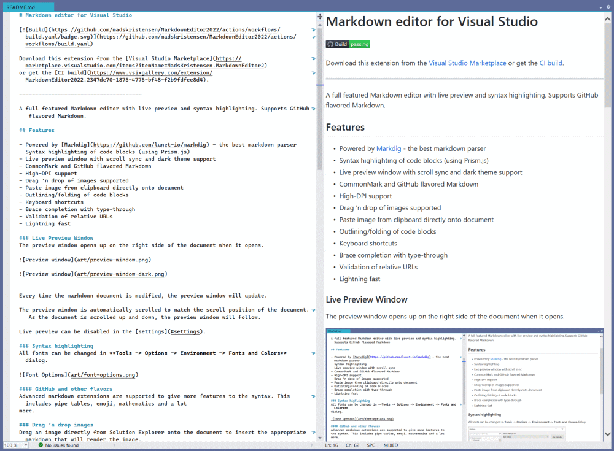
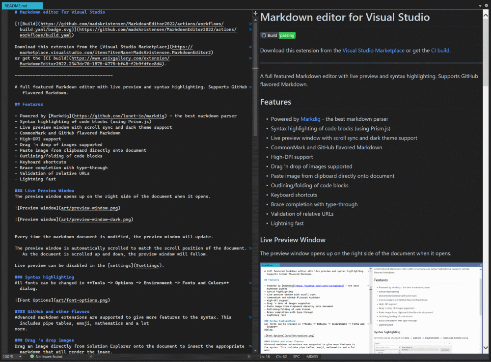
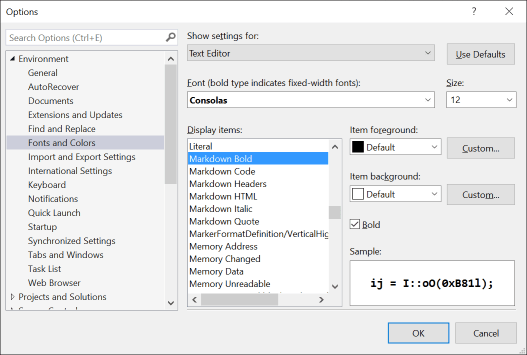
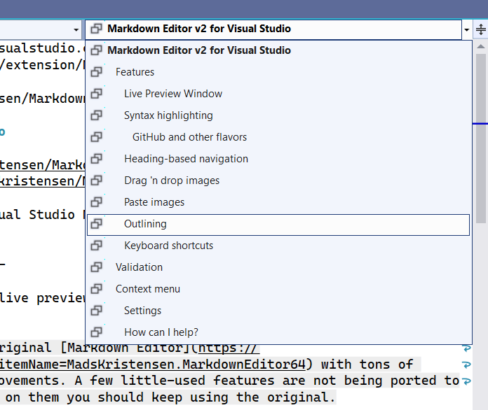
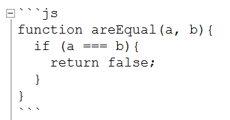
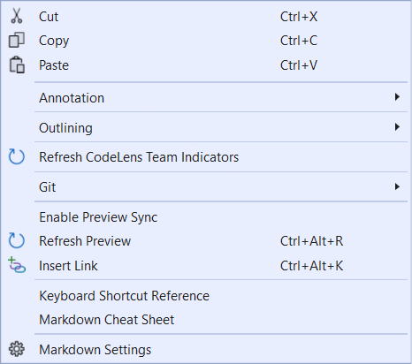
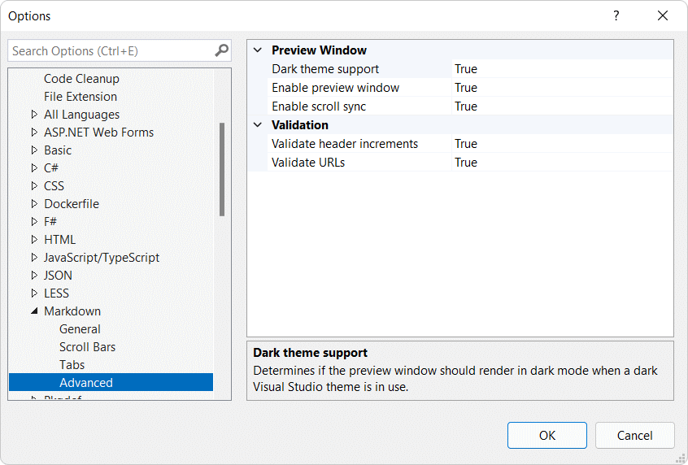

[marketplace]: <https://marketplace.visualstudio.com/items?itemName=MadsKristensen.MarkdownEditor2>
[vsixgallery]: <http://vsixgallery.com/extension/MarkdownEditor2022.2347dc70-1875-4775-bf48-f2b9fdfee8d4/>
[repo]:<https://github.com/madskristensen/MarkdownEditor2022>

# Markdown Editor v2 for Visual Studio

[](https://github.com/madskristensen/MarkdownEditor2022/actions/workflows/build.yaml)


Download this extension from the [Visual Studio Marketplace][marketplace]
or get the [CI build][vsixgallery].

--------------------------------------

This extension delivers a full featured Markdown editor with live preview, syntax-aware editing, and turnkey workflows for GitHub flavored Markdown.

> This is a complete rewrite of the original [Markdown Editor](https://marketplace.visualstudio.com/items?itemName=MadsKristensen.MarkdownEditor64) with tons of fixes, tweaks, and performance improvements. A few little-used features are not being ported to this new extension, so if you rely on them you should keep using the original.

For linting and validation rules, this extension integrates with the [Markdown Lint](https://marketplace.visualstudio.com/items?itemName=MadsKristensen.MarkdownLint) extension.

## Getting Started

1. Install the extension from the [Visual Studio Marketplace][marketplace] or grab the latest [CI build][vsixgallery].
2. Open any `.md` file in Visual Studio to enable the Markdown editor.
3. Press `F7` to show or hide the synchronized preview window while you edit.
4. Visit **Tools -> Options -> Text Editor -> Markdown** to tune fonts, preview behavior, and custom assets.

## Feature Highlights

### Editing essentials

- Powered by [Markdig](https://github.com/lunet-io/markdig), providing the best available Markdown parser.
- Syntax highlighting powered by Prism.js keeps fenced code blocks readable.
- Supports CommonMark, GitHub flavored Markdown, FrontMatter YAML, Mermaid, and math notation.
- Brace completion with type-through maintains list formatting and block structure.
- Lightning fast performance even in large documentation sets.

### Live preview

- Live preview window with scroll sync and dark theme support.
- Switch between vertical and horizontal layouts depending on the workspace.
- Automatically updates on each keystroke and tracks the editor caret.
- Honors custom CSS and HTML templates so the preview matches your documentation brand.

### Navigation and structure

- Jump between headings from the NavigationBar or generated table of contents.
- Collapse or expand fenced code and HTML blocks to stay focused.

### Media workflows

- Drag and drop images directly from Solution Explorer or File Explorer.
- Paste images from the clipboard, name them relative to the document, and get friendly alt text automatically.

### Productivity tools

- Extensive keyboard shortcuts speed up formatting, linking, commenting, and checklist maintenance.
- VS command URL links trigger Visual Studio commands straight from the preview pane.

The sections below dive deeper into each area and include screenshots for quick orientation.

### Live Preview Window

The preview window opens up on the right side of the document when it opens. Use `F7` to toggle the preview window on and off.





Every time the markdown document is modified, the preview window will update.

The preview window is automatically scrolled to match the scroll position of the document. As the document is scrolled up and down, the preview window will follow.

Live preview can be managed in the [settings](#settings).

#### Auto-hide tool window support

The preview window uses WebView2 which, due to its HWND-based rendering, can overlap Visual Studio's auto-hide tool windows (like Solution Explorer when pinned to auto-hide). To mitigate this, enable **Auto-hide for tool windows** in the settings.

When enabled, the preview temporarily hides when you expand an auto-hide tool window, and automatically reappears when the tool window collapses back. This ensures you can always interact with your tool windows without the preview getting in the way.

### Syntax highlighting

All fonts can be changed in **Tools -> Options -> Environment -> Fonts and Colors** dialog.



#### GitHub and other flavors

Advanced markdown extensions are supported to give more features to the syntax. This includes pipe tables, emoji, mathematics and a lot
more.

### Table formatting

Use Visual Studio's standard format commands to align and beautify pipe tables:

**Ctrl+K, Ctrl+D** formats all tables in the document.

**Ctrl+K, Ctrl+F** formats tables within the current selection.

The formatter aligns columns, pads cells to consistent widths, and respects column alignment markers (`:---`, `:---:`, `---:`).

Before:

```markdown
| Name | Description | Price |
|---|:---:|---:|
| Widget | A small gadget | $9.99 |
| Gizmo | A larger device | $24.95 |
```

After:

```markdown
| Name   | Description      |  Price |
|--------|:----------------:|-------:|
| Widget | A small gadget   |  $9.99 |
| Gizmo  | A larger device  | $24.95 |
```

### IntelliSense

#### Emoji IntelliSense

You get full IntelliSense for over 1,600 emoji and smiley characters.


#### File path IntelliSense

When typing links `[text](` or images ``
- Markdown files are prioritized when completing regular links `[]()`
- Supports relative paths including `./` and `../` navigation

#### Anchor IntelliSense

Type `#` inside a link to get completions for all headings in the current document:

```markdown
[Jump to section](#heading-name)
```

Headings are shown with their level indicator (##, ###, etc.) and automatically generate GitHub-compatible anchor slugs. Duplicate headings are handled with `-1`, `-2` suffixes.

### Heading-based navigation

The NavigationBar shows all of the document headings, like a table of contents. Select a heading to jump to that section of the document.



### Drag 'n drop images

Drag an image directly from Solution Explorer onto the document to insert the appropriate markdown that will render the image.

### Paste images

This is really helpful for copying images from a browser or for inserting screen shots. Simply copy an image into the clipboard and paste it directly into the document. This will prompt you for a file name relative to the document and then it inserts the appropriate markdown.

It will even parse the file name and make a friendly name to use for the alt text.

### Outlining

Any fenced code and HTML blocks can be collapsed, so that this:



...can be collapsed into this:


### Keyboard shortcuts

**Ctrl+Alt+R** Refresh the preview window.

**Ctrl+Alt+K** Inserts a new link.

**Ctrl+B** makes the selected text bold by wrapping it with `**`.

**Ctrl+I** makes the selected text italic by wrapping it with `_`.

<!--**Ctrl+Shift+C** wraps the selected text in a code block.-->
**Ctrl+Space** checks and unchecks task list items.

```markdown
- [x] task list item
```

**Tab** increases indentation of list items.

**Shift+Tab** decreases indentation of list items.

**Ctrl+K,C** wraps the selection with HTML comments.

**Ctrl+K,U** removes HTML comments surrounding the selection/caret.

<!--**Ctrl+PgUp** moves caret to previous heading

**Ctrl+PgDown** moves caret to next heading-->

## Automation

### VS command URL scheme support

The markdown editor now supports executing Visual Studio commands directly from links in the preview window using the `vscmd://` URL scheme.

**Example usage:**

```markdown
[Code Search](vscmd://Edit.GoToAll)
[Solution Explorer](vscmd://View.SolutionExplorer)
[Build Solution](vscmd://Build.BuildSolution)
```

When you click these links in the preview window, the corresponding Visual Studio commands will be executed. A status message will show the result of the command execution.

## Custom styles and template

You can provide your own .CSS and HTML templates used to render the preview window. The extension will look for the files **md-styles.css** and **md-template.html** in the same folder and any parent folder. If one or both of these files are found, they are being applied in the preview.

The HTML template must contain the string **[content]** which is where the rendered markdown will be injected.

You have to refresh the preview window after making changes to the custom CSS and HTML file. You can do that from the markdown editor context menu or by hitting **Ctrl+Alt+R**.

## Context menu

Right-click anywhere in the markdown document to access the **Markdown** submenu with common tasks, such as toggling the preview window scroll sync, see Markdown references, and getting to the settings dialog.



## Settings

Control the settings for this extension under
**Tools -> Options -> Text Editor -> Markdown**



| Setting | Description |
|---------|-------------|
| Enable preview window | Shows the live preview pane when opening markdown files |
| Enable scroll sync | Synchronizes scrolling between the editor and preview |
| Preview window position | Choose between right-side or bottom placement |
| Preview window width/height | Set the size of the preview pane |
| Auto-hide for tool windows | Temporarily hides the preview when auto-hide tool windows expand, preventing overlap issues |

### How can I help?

If you enjoy using the extension, please give it a ★★★★★ rating on the [Visual Studio Marketplace][marketplace].

Should you encounter bugs or if you have feature requests, head on over to the [GitHub repo][repo] to open an issue if one doesn't already exist.

Pull requests are also very welcome, since I can't always get around to fixing all bugs myself. This is a personal passion project, so my time is limited.

Another way to help out is to [sponsor me on GitHub](https://github.com/sponsors/madskristensen).
