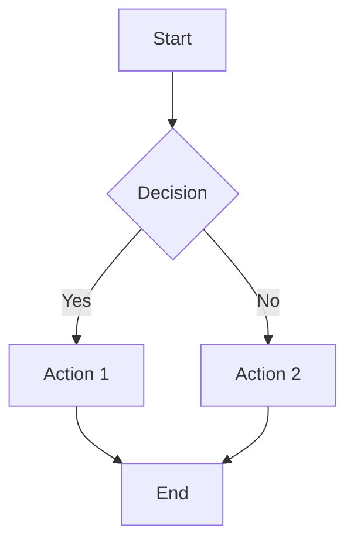
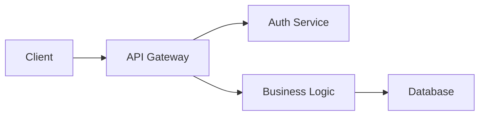
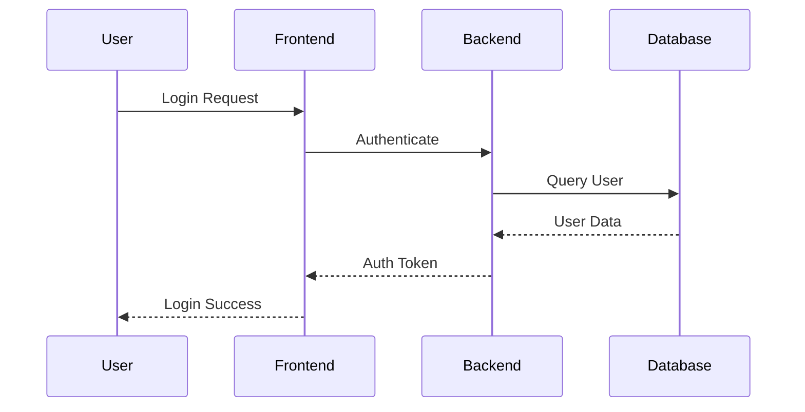
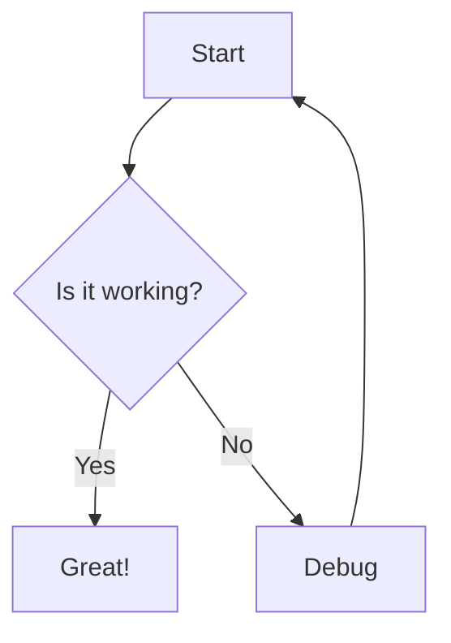

# Mermaid Diagram Types Test

This document tests various Mermaid diagram types to verify support.

## Graph TB (Top to Bottom)

## Graph LR (Left to Right)

## Sequence Diagram

## Flowchart (Modern Syntax)

## Azure DevOps Colon Syntax

::: mermaid
graph TB
    Start --> End
:::
